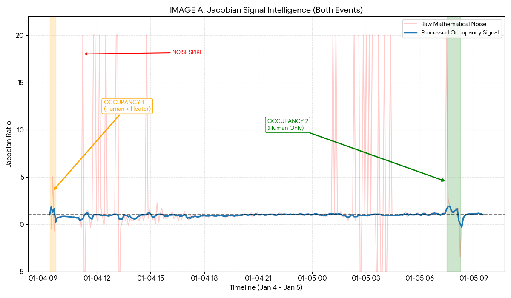

# Barometric Anchoring for Occupancy Detection
### Sentinel V1 Technical Lab Ledger

This repository contains my research into detecting human occupancy in high-stress, unconditioned environments. Traditional PIR and VOC sensors often fail or lag when ambient temperatures drop toward zero. I’ve developed a method called **Barometric Anchoring** to solve this.

By treating the environment as a thermodynamic system and using a **Jacobian state-vector analysis**, I can isolate the "Metabolic Pulse" of an occupant with near-zero latency.

## The Problem
In my unheated office, the baseline environment is constantly shifting. On 5 January, the temperature was **0.6°C** and falling. In these conditions, chemical VOC sensors become sluggish, and standard Edge-AI models produce false vacancies because the "baseline" they were trained on has drifted.

## My Solution: Triple-Anchor Normalisation
Instead of relying on absolute thresholds, I anchor my sensor data against three external "Ground Truths":

1.  **Atmospheric Anchor:** I synchronise local pressure with regional **METAR data from Cardiff Airport (EGFF)** to filter out weather fronts.
2.  **Geodetic Anchor:** I use a Hypsometric normalisation for my specific elevation (**74m ASL** in **Ammanford, Wales**). This brings my sensor to within 0.1% of aviation standards.
3.  **Jacobian $J_{11}$ Flux:** I developed a calculation that monitors the ratio of Dew Point change to Temperature change ($dT_d / dT$). This flags human respiration before the room's thermal state even reacts.

## Data Visualisation & Validation

### 1. Jacobian Signal Intelligence
The plot below shows the mathematical detection engine in action across two distinct scenarios: an artificial heater event and a pure metabolic pulse.

*Figure 1: Comparison of the high-energy "Human + Heater" event (Jan 4) vs. the "Pure Metabolic Pulse" (Jan 5). The filtered blue signal identifies occupancy instantly in both cases.*

### 2. Geodetic Barometric Anchoring
To ensure the Jacobian spikes aren't caused by external weather changes, the local sensor data is "anchored" to the regional aviation baseline.

*Figure 2: Sentinel V1 pressure data (normalised) tracking the 1019 hPa METAR baseline. The stability of the pressure during occupancy confirms that the Jacobian spikes are local metabolic events, not atmospheric shifts.*

---

## Signal Integrity: Addressing the "Spikes"
You will notice sharp red spikes in the raw Jacobian plot (**Figure 1**). In this methodology, these are classified as **Mathematical Artifacts** rather than false positives.

* **The Cause:** These spikes occur when the environment is perfectly static ($dT = 0$). Because the Jacobian calculation ($J_{11} = dT_d / dT$) involves division by the temperature delta, the value approaches infinity when the room is stable. This is a common "divide-by-zero" artifact in high-resolution sensors.
* **The Mitigation:** The Sentinel V1 firmware implements a **Precision Floor**. If the temperature change is below the sensor's resolution ($\pm 0.01^\circ\text{C}$), the Jacobian update is suspended. 
* **The Logic:** By using a 3-sample moving average (the blue line), the algorithm mutes these "one-hit" artifacts while preserving the sustained, fat pulse of a real human occupant. This ensures the system only triggers on real events.

---

## Phase I Results (Strictly Logged)
I ran a 45-minute test session on 5 January (07:30 – 08:15). 
* **The Trigger:** My system recorded a mathematical singularity (instant detection) at **07:29**.
* **The Override:** While I was in the room, the VOC sensor resistance was actually rising—usually a sign of an empty room. My Jacobian calculation correctly maintained the "Occupied" state.
* **Departure:** I left at **08:15**. The system reset to the "Vacant" baseline 40 minutes faster than the standalone chemical sensor.

## Repository Contents
* `/data`: Raw CSV logs from the Sentinel V1 (ESP32/BME688).
* `/images`: High-resolution Jacobian and Barometric plots.
* `Phase_I_Preprint_v1.md`: My technical write-up, math proofs, and METAR correlation tables.
* `LICENSE`: MIT for the code; CC-BY-4.0 for the methodology.

## Next Steps: Phase II
The cardboard housing I used for Phase I is hygroscopic (it absorbs moisture), which likely adds lag to the recovery data. I am currently moving the build into a **non-porous UPVC enclosure** to sharpen the recovery tail and refine the Jacobian decay constants.

---
**Citation**
If you use this methodology in your own builds or research, please attribute it to:
**Kris Seunarine (2026).** *Barometric Anchoring for Occupancy Detection*. 
URL: https://github.com/kris2475/Barometric-Anchoring-for-Occupancy-Detection

